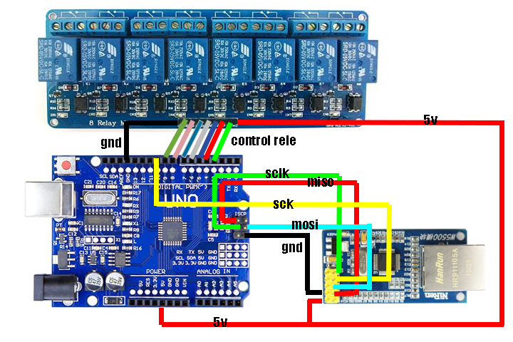

# Control centralizado via IP usando API-REST

El siguiente proyecto permite controlar 8 reles via IP a través el protocolo HTTP REST con solo una Arduino UNO, una W5500, Y una placa de 8 reles.

# Escquema:

# Materiales:
- Arduino UNO o MEGA
- Placa Ethernet W5500
- Placa de 8 Reles

# Datos:
MAC ADDRESS: DE-AD-BE-EF-FE-ED
SERIAL SPEED: 9600

# Uso:
El sistema de control de barrera cuenta con 8 salidas a través de relés mecánico. 
Para comandarlos, la placa cuenta con un control TCP-IP con dirección obtenida por DHCP, recibiendo comandos por HTTP en puerto 80 de TCP el cual se accede a través de API-REST con el verbo GET, pasando los siguientes parámetros:
-	switch
-	state
-	time
-	
Donde:

SWITCH, puede tomar valores entre 1 y 8, donde cada valor corresponde a un relé de salida.
STATE, puede tomar valores iguales a 0 o 1, donde 0 implica rele abierto y 1 cerrado.
TIME, Que puede tomar valores entre 1 y 9, correspondiendo cada uno de estos, al tiempo en segundos que se deberá transitar para invertir el estado que se haya indicado. 

por ejemplo:

Si el rele 1 se encuentra en estado ABIERTO y quiero que por 3 segundos pasea estado CERRADO para luego regresar a su estado previo debería escribir:

http://ip?switch=1state=1&time=3

Esto devolverá la siguiente estructura en formato JSON:

{status:[{"rele":"1", "state":"1" },{"rele":"2", "state":"0" },{"rele":"3", "state":"0" },{"rele":"4", "state":"0" },{"rele":"5", "state":"0" },{"rele":"6", "state":"0" },{"rele":"7", "state":"0" },{"rele":"8", "state":"0" },{"rele":"", "state":"" }]}

En donde se puede observar que el rele 1 se encuentra en estado CERRADO.

Nota: lo parámetros deben ser pasados siempre en minúscula ya que el sistema es case sensitive

En caso de que se quiera setear a un rele en un estado fijo, o sea no temporizado, se deberá realizar el mismo procedimiento, pero sin indicar un parámetro TIME, o bien especificándolo en 0. 

Por ejemplo, sí quiero activar el relé uno y mantenerlo en ese estado deberé escribir:

http://ip?switch=1state=1

O bien:

http://ip?switch=1state=1&time=0

En caso de que se quiera obtener el estado de los reles sin ejecutar acción alguna, deberemos enviar solo el parámetro switch=0, de esta forma:

http://ip?switch=0

# Contactanos en:
https://www.linkedin.com/company/35599193/admin/

# Seguime en:
https://www.linkedin.com/in/fernando-p-maniglia/

# Conocenos más en:
https://www.seamansrl.com.ar
